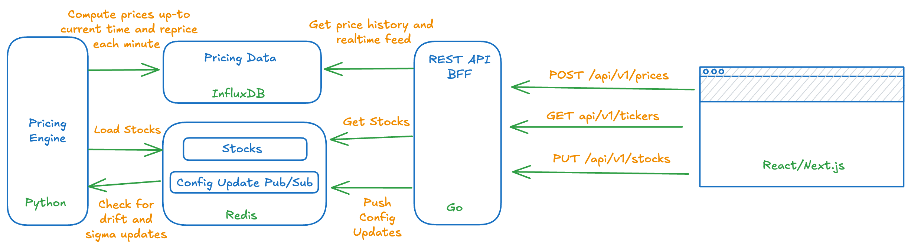

# BMO Pricing Engine

## Overview & Assumptions

In this takehome, I emphasized the architecting of a scalable containerized distributed system that tolerates eventual consistency within a few seconds. The system is designed to cover a universe of 50,000 stocks with up to a few thousand DAU who monitor a basket of 50 stocks.

While "functional", the application is not production-ready &#9786;. Out of scope is extensive testing of the system, GBM model validation (e.g. annualization conventions for volatility and drift), refactoring, and the implementation of advanced charting and animations for smooth UX.

At a high level the application works as follows:

To run with Docker Compose:

* `docker compose build`
* `docker compose up -d`
* or just `docker compose up --build --force-recreate -d`

## Pricing Engine

Pricing of securities will likely involve complex mathematical models build by the quant team with `Python` Data Stack. For this reason it makes sense to run the pricing engine as independently scalable `Python` process. If needed, pricing jobs can be partioned by security type or id.

In this takehome, the engine loads securities from the initial `.csv` file into `Redis` to create a single source of truth for the stock parameters. It then reproducibly prices stocks with `pandas` and `numpy` up to the current time and injects the data into `InfluxDB`. After that the process, reprices securities every minute, checking for user-updates from a `Redis` queue, and injects the data into `InfluxDB`.

## BFF

The frontend is served by a light-weight Backend For Frontend (BFF) server implemented in Go for high performance with the following REST APIs:

* `GET /api/v1/stocks` returns a list of all stocks priced by the engine, e.g., `"tickers": ["MSFT US","AAPL US","GOOG US"]`
* `POST v1/stocks/parameters` and `PUT v1/stocks/parameters` to query a list of stock parameters and update stocks parameters.
* `api/v1/stocks/history` to get prices upto intial load of the front end.
* `api/v1/stocks/feed` to get the lastest prices.

Due to time-limitations, the DATA flow is intirely pull-based. If evetual consistency is unacceptable, push-based approaches can be explored. For example, a Websockets can subcribe to a `Redis` channel and push updates to the frontend.

## InfluxDB and Redis

`InfluxDB` is a time series database that supports heavy write loads. It also provides monitoring and query capabilities to the pricing team. The dashoard is available at `http://localhost:8086/` username: `nvsaleev` password: `bmo_global123`.

`Redis` is a in-memory data store that is used to store parameter configuration. It also supports a queue that is used push parameter updates to the pricing engine. To respect single resoposibility, the pricing engine updates the parameters in Redis and the BFF server has read-only access.

## Frontend

The frontend is `React/Next.js` application that uses `AgGrid` and `AgCharts` to display the data. The entreprise versions of these libraries allows to customize grids and charts without deploying significant man-power. e.g. zoom on the chart.
There is no multi-user support and some UX features are lacking.

## Some Next Steps

* Tesing and validation of the model: e.g. annualization conventions for volatility and drift given trading days and trading minutes.
* UX Improvements like adding ability to zoom in on the Chart (e.g. enable navigator for entreprise version)
* Refactoring: there's a fair amount of boileplate code or inaptly named variables and functions.
* The pricing engine should be factored into a robust job queue with retry cababilities.
* Reliability, Fault-tolerance, and auto-scaling provisions.
