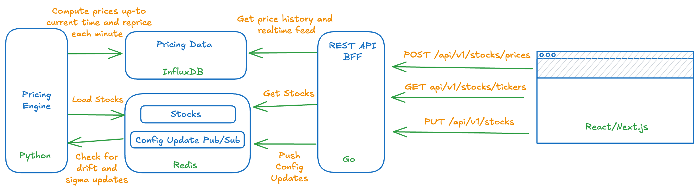

# BMO Pricing Engine

## Overview & Assumptions

In this takehome, I emphasized the architecting of a scalable containerized distributed system that tolerates eventual consistency withing a few seconds. The system is designed to cover a universe of 50,000 stocks with up to a few thousand DAU that monitor a busket of 50 stocks.

Out of scope is extensive testing of the system, GBM model validation (e.g. annualization conventions for volatility and drift), and the implementation of advanced charting and animations for smooth UX.

At a high level the application works as follows:

## Pricing Engine

TODO
